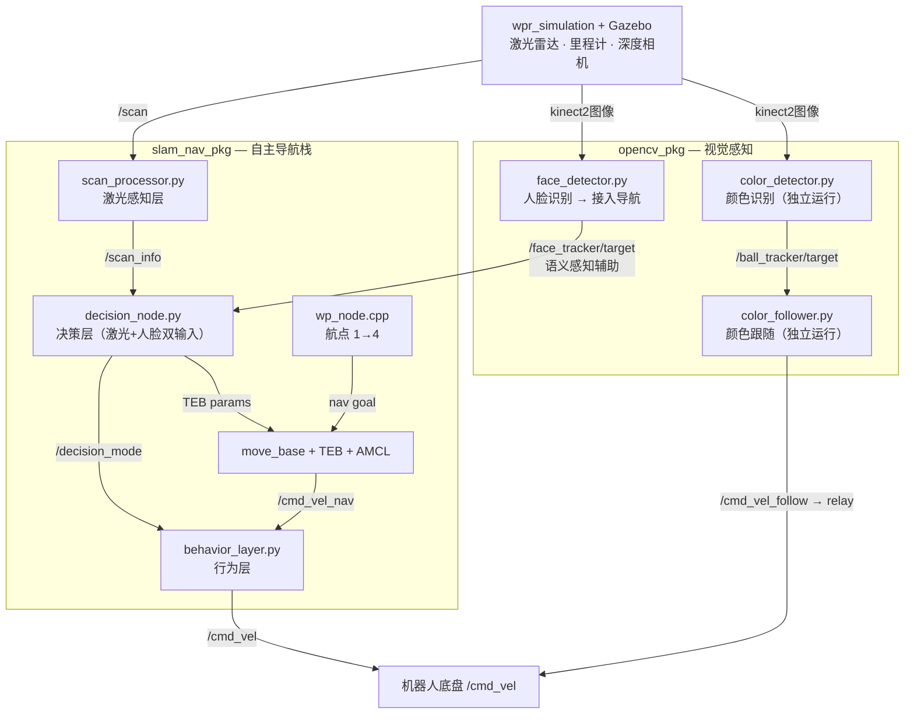

# ros_slam_nav — ROS 机器人导航与视觉感知系统

> 基于 ROS 1 Noetic 的移动机器人完整功能栈：SLAM 建图、自主导航、视觉感知辅助避障与颜色目标追踪。

**平台**：ROS 1 Noetic · Gazebo 仿真 · Python 3 / C++  
**机器人**：WPB Home（wpb_home + wpr_simulation）

---

## 功能包总览

| 功能包 | 职责 | 详细文档 |
|--------|------|----------|
| `slam_nav_pkg` | SLAM 建图、AMCL 定位、TEB 路径规划、状态机决策（激光+视觉双输入）、航点导航 | [slam_nav_pkg/README.md](src/slam_nav_pkg/README.md) |
| `opencv_pkg` | 颜色目标识别追踪（独立运行）、人脸识别（接入导航决策层） | [opencv_pkg/README.md](src/opencv_pkg/README.md) |

第三方依赖包（不修改）：`waterplus_map_tools` · `wpb_home` · `wpr_simulation`

---

## 系统架构



---

## 项目结构

```
ros_slam_nav/
├── src/
│   ├── slam_nav_pkg/        # 自主导航功能包
│   ├── opencv_pkg/          # 视觉感知功能包
│   ├── waterplus_map_tools/ # 地图工具（第三方）
│   ├── wpb_home/            # 机器人驱动（第三方）
│   └── wpr_simulation/      # Gazebo 仿真（第三方）
├── build/
└── devel/
```

---

## 快速开始

### 编译

```bash
cd ~/ros_projects/ros_slam_nav
catkin_make
source devel/setup.bash
```

### 自主导航 + 人脸辅助避障

```bash
# SLAM 建图
roslaunch slam_nav_pkg bringup.launch mode:=slam
rosrun map_server map_saver -f src/slam_nav_pkg/maps/map

# 自主导航
roslaunch slam_nav_pkg bringup.launch mode:=nav

# 人脸识别接入（另开终端，可选）
roslaunch opencv_pkg face.launch
```

### 颜色追踪（独立运行）

```bash
roslaunch wpr_simulation wpb_balls.launch
roslaunch opencv_pkg color.launch target_color:=red
```

### 人脸识别单独测试

```bash
roslaunch wpr_simulation wpr1_single_face.launch
rosrun opencv_pkg face_detector.py
rosrun wpr_simulation keyboard_vel_ctrl   # 键盘控制机器人靠近人物
```

---

## 依赖安装

```bash
sudo apt install \
  ros-noetic-move-base \
  ros-noetic-teb-local-planner \
  ros-noetic-gmapping \
  ros-noetic-amcl \
  ros-noetic-map-server \
  ros-noetic-dynamic-reconfigure \
  ros-noetic-cv-bridge \
  ros-noetic-topic-tools \
  python3-opencv
```