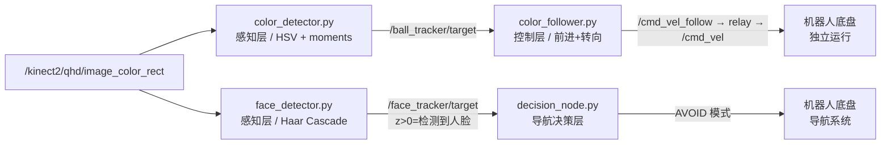

# opencv_pkg — 视觉感知功能包

> 基于 OpenCV 的颜色目标追踪与人脸识别，人脸识别结果直接接入导航决策层。

**平台**：ROS 1 Noetic · Python 3 · OpenCV 4

---

## 系统架构



### 两个子功能定位

| 功能 | 节点 | 用途 | 接入方式 |
|------|------|------|----------|
| 颜色追踪 | color_detector + color_follower | 独立运行，追踪指定颜色球 | relay → /cmd_vel |
| 人脸识别 | face_detector | 接入导航，检测到人→减速避让 | /face_tracker/target → decision_node |

---

## 包结构

```
opencv_pkg/
├── launch/
│   ├── color.launch      # 颜色识别 + 跟随 + relay（独立运行）
│   └── face.launch       # 人脸识别（接入导航系统）
├── scripts/
│   ├── color_detector.py # 感知层：HSV 颜色识别，trackbar 调参
│   ├── color_follower.py # 控制层：颜色目标跟随（前进 + 转向）
│   └── face_detector.py  # 感知层：Haar Cascade 人脸识别
├── CMakeLists.txt
└── package.xml
```

---

## 快速开始

### 颜色追踪（独立运行）

```bash
# 终端1：启动仿真
roslaunch wpr_simulation wpb_balls.launch

# 终端2：颜色追踪（拖动 trackbar 调整 HSV 到目标颜色）
roslaunch opencv_pkg color.launch

# 查看识别画面
rosrun rqt_image_view rqt_image_view /ball_tracker/image
```

### 人脸识别接入导航

```bash
# 终端1：启动导航系统
roslaunch slam_nav_pkg bringup.launch mode:=nav

# 终端2：启动人脸识别
roslaunch opencv_pkg face.launch

# 终端3（可选）：查看识别画面
rosrun rqt_image_view rqt_image_view /face_tracker/image
```

检测到人脸后，`decision_node` 自动收到 `/face_tracker/target`，在激光触发之前提前切入 `AVOID` 模式减速。

### 单独测试人脸识别

```bash
# 终端1：生成人物模型
roslaunch wpr_simulation wpr1_single_face.launch

# 终端2：人脸识别节点
rosrun opencv_pkg face_detector.py

# 终端3：键盘控制机器人靠近人物
rosrun wpr_simulation keyboard_vel_ctrl
```

---

## 节点说明

### `color_detector.py` — 感知层

基于 `demo_cv_hsv.py`，保留 trackbar / HSV 流程 / 形态学处理风格。

| 修改项 | 原版 | 改后 |
|--------|------|------|
| 质心计算 | 双重 for 循环 | `cv2.moments()` |
| imshow | 回调线程（黑屏）| 主循环（正常显示）|
| 新增 | — | 发布 `/ball_tracker/target`（Point）|

**输出 Point 规范**：
```
x: 水平归一化 -1.0(左) ~ +1.0(右)
y: 垂直归一化 -1.0(上) ~ +1.0(下)
z: 面积比 0.0~1.0，z==0 表示未检测到
```

### `color_follower.py` — 控制层

订阅 `/ball_tracker/target`，速度计算公式与 `demo_cv_follow.py` 完全一致：

```python
vel_turn    = (IMAGE_WIDTH  / 2 - target_x_px) * 0.0005
vel_forward = (IMAGE_HEIGHT / 2 - target_y_px) * 0.001
```

### `face_detector.py` — 感知层

基于 `demo_cv_face_detect.py`，追踪面积最大人脸（距离最近）。

| 修改项 | 原版 | 改后 |
|--------|------|------|
| imshow | 回调线程（黑屏）| 主循环（正常显示）|
| 新增 | 单一检测框 | 最大人脸红框，其余灰框 |
| 新增 | — | 发布 `/face_tracker/target`（Point）|
| 新增 | — | equalizeHist 提升暗环境检测率 |

`z > 0` 时 `decision_node` 触发 AVOID；`z == 0` 时恢复 NAV（带防抖）。

---

## 依赖

```bash
sudo apt install \
  ros-noetic-cv-bridge \
  ros-noetic-sensor-msgs \
  ros-noetic-geometry-msgs \
  ros-noetic-topic-tools \
  python3-opencv
```