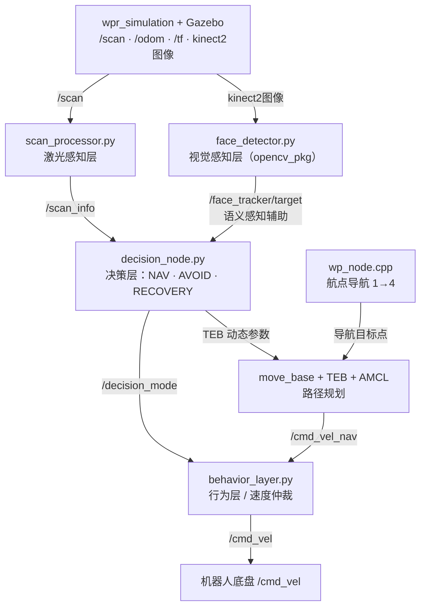

# slam_nav_pkg — 自主导航功能包

> SLAM 建图、AMCL 定位、TEB 局部规划、分层状态机决策、航点自主导航。
> 决策层同时接入激光感知（scan_processor）和视觉感知（face_detector），实现语义辅助避障。

**平台**：ROS 1 Noetic · Gazebo · Python 3 / C++

---

## 系统架构



### 设计原则

- **`/cmd_vel` 唯一出口** —— `behavior_layer` 直接发布 `/cmd_vel`；`move_base` 在 nav.launch 中 remap 到 `/cmd_vel_nav`
- **双感知输入** —— 激光（scan_processor）+ 视觉（face_detector）同时输入 decision_node
- **语义辅助避障** —— 人脸检测到时，在激光触发之前提前切 AVOID 减速
- **状态防抖** —— 模式切换需持续 ≥ 0.5 秒；RECOVERY 最少停留 3 秒

---

## 状态机

```
           前方障碍 / 检测到人脸
NAV ─────────────────────────────► AVOID
 ▲                                    │
 │         路通且无人脸（防抖 0.5s）   │
 └──────────────────────────────────── ┘
 ▲
 │   清理代价地图 + 重新规划
 └─────────────────── RECOVERY
                          ▲
          距离过近          │
      （任意状态）─────── ┘
```

### AVOID 触发条件（两路输入，任一满足即触发）

| 触发源 | 条件 | 优势 |
|--------|------|------|
| scan_processor | `front_distance < 0.5m` | 精确测距 |
| face_detector | `z > 0`（检测到人脸） | 比激光提前减速，语义感知 |

| 模式 | TEB `max_vel_x` | 行为策略 |
|------|-----------------|----------|
| NAV | 0.5 m/s | 透传 move_base 输出 |
| AVOID | 0.2 m/s | 限速 + 向开阔侧比例转向 |
| RECOVERY | 0.05 m/s | 后方有空间则倒退，朝开阔侧旋转 |

---

## 包结构

```
slam_nav_pkg/
├── launch/
│   ├── bringup.launch       # 主启动（mode:=slam | nav）
│   ├── slam.launch          # gmapping
│   └── nav.launch           # AMCL + move_base + 三层节点
├── config/
│   ├── rviz/
│   │   ├── gmapping.rviz
│   │   └── nav.rviz
│   ├── nav/
│   │   ├── teb_local_planner_params.yaml
│   │   ├── local_costmap_params.yaml
│   │   ├── global_costmap_params.yaml
│   │   ├── costmap_common_params.yaml
│   │   ├── move_base_params.yaml
│   │   └── amcl_params.yaml
│   ├── decision.yaml
│   ├── behavior.yaml
│   └── scan.yaml
├── scripts/
│   ├── scan_processor.py    # 激光感知层
│   ├── decision_node.py     # 决策层（激光 + 人脸双输入）
│   ├── behavior_layer.py    # 行为层
│   └── obstacle_marker.py   # RViz 可视化
├── src/
│   └── wp_node.cpp
├── msg/
│   └── ScanInfo.msg
└── maps/
    ├── map.pgm
    └── map.yaml
```

---

## 快速开始

### 1. SLAM 建图

```bash
roslaunch slam_nav_pkg bringup.launch mode:=slam
rosrun map_server map_saver -f src/slam_nav_pkg/maps/map
```

### 2. 自主导航（含人脸避让）

```bash
# 终端1：导航系统
roslaunch slam_nav_pkg bringup.launch mode:=nav

# 终端2：人脸识别接入决策层（可选，不启动时人脸避让功能关闭）
roslaunch opencv_pkg face.launch
```

### 3. 验证

```bash
rostopic info /cmd_vel          # Publishers 只有 behavior_layer
rostopic echo /decision_mode    # NAV / AVOID / RECOVERY
rostopic echo /face_tracker/target  # z>0 有人脸
```

---

## 节点说明

### `decision_node.py` — 决策层

**输入**：`/scan_info`（激光）+ `/face_tracker/target`（视觉，可选）  
**输出**：`/decision_mode`、`/cmd_vel_avoid`、`/cmd_vel_recovery`

| 参数 | 默认值 | 说明 |
|------|--------|------|
| `threshold_avoid` | 0.5 m | 激光触发 AVOID 距离 |
| `threshold_recovery` | 0.3 m | 激光触发 RECOVERY 距离 |
| `debounce_time` | 0.5 s | 模式切换防抖 |
| `recovery_min_duration` | 3.0 s | RECOVERY 最短停留 |
| `face_timeout` | 2.0 s | face_detector 停止发布后的超时保护 |

### `scan_processor.py` — 激光感知层

| 参数 | 默认值 | 说明 |
|------|--------|------|
| `front_half_angle` | 30° | 前方扇区半角 |
| `blocked_threshold` | 0.5 m | 阻塞判定距离 |
| `smoothing_window` | 3 | 移动均值窗口 |

### `behavior_layer.py` — 行为层

优先级：`遥控 → RECOVERY → AVOID → NAV`

| 参数 | 默认值 | 说明 |
|------|--------|------|
| `safe_distance_critical` | 0.25 m | 线速度缩至 50% |
| `safe_distance_warn` | 0.35 m | 线速度缩至 80% |
| `teleop_timeout` | 0.5 s | 遥控超时自动交还 |
| `ema_alpha_linear` | 0.85 | 线速度 EMA 系数 |

### `wp_node.cpp` — 航点节点

顺序执行航点 1→4，失败时指数退避重试（1→2→4s，最多 3 次），回调内无阻塞。

---

## 自定义消息

```
# ScanInfo.msg
float32 front_distance
float32 left_distance
float32 right_distance
float32 back_distance
float32 min_distance
float32 danger_level
bool    front_blocked
bool    left_blocked
bool    right_blocked
string  obstacle_direction
```

---

## 配置文件

| 文件 | 调节内容 |
|------|----------|
| `teb_local_planner_params.yaml` | TEB 速度、加速度、轮廓 |
| `local_costmap_params.yaml` | 局部地图尺寸、频率 |
| `global_costmap_params.yaml` | 全局地图参数 |
| `costmap_common_params.yaml` | 膨胀半径、障碍物层 |
| `move_base_params.yaml` | 规划器、目标容差、恢复行为 |
| `amcl_params.yaml` | 粒子数、运动模型 |
| `decision.yaml` | 状态机阈值、防抖、TEB 各模式参数、face_timeout |
| `behavior.yaml` | 安全距离、加加速度、EMA |
| `scan.yaml` | 扇区角度、测距范围、平滑窗口 |